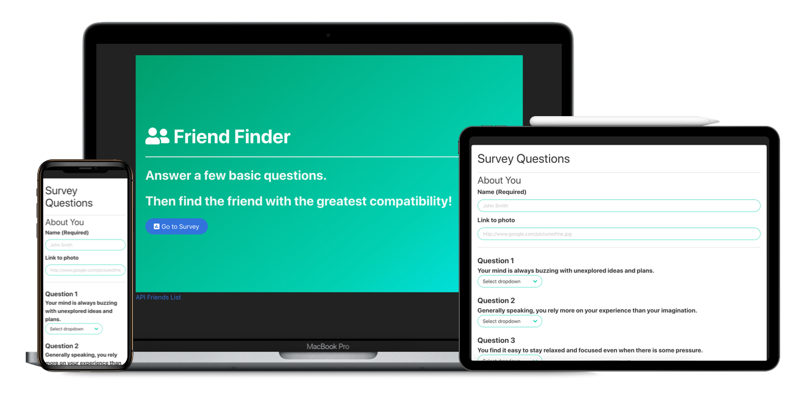

# Friend Finder

## Description
FriendFinder is a full stack, dating web app. Once inside the user simply completes a survey and receives back their most compatible match "friend" based on thier answers. You can take a look at the deployed live website on <a href="#">here</a> on Heroku.

## What's inside
- HTML 5
- CSS
- Bulma
- JavaScript
- jQuery
- AJAX
- Node.js
- Express.js
- Path

## How it works
HTML5 files are written using the Bulma Framework for styling, with a little CSS at the top for some margin and padding. Express in Node.js sets up the server port, handles the Get and Post requests and routing. Path delivers the built html files. jQuery grabs the values from the HTML survey form and Posts the data to the API with AJAX. 

Finally, more than Node.js, JavaScript holds all of the users as indvidual objects and handles the logic of comparing them to output the greatest match based on minimum score differences (the smallest difference in scores is the best match!) in a classic Modal. 